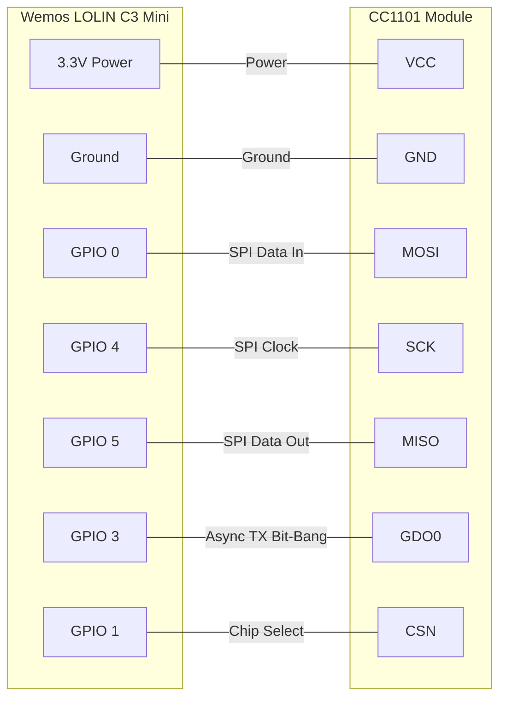

# Dogtrace d-control 400 remote clone (ESP32-C3 + CC1101)

This project replicates the control signal for a Dogtrace d-control 400 electric dog collar using a Wemos LOLIN C3 Mini (ESP32-C3) and a CC1101 transceiver module.

⚠️ IMPORTANT PROJECT SCOPE & DISCLAIMERS:
* Unknown Protocol: The underlying communication protocol is not publicly available, so the precise byte frame to be used, the precise RF parameters, or checksum logic used by Dogtrace is unknown. This project does not attempt to reverse engineer the protocol or implement a true "clone" of the remote.
* Raw Replay: The signal transmitted by this code is a raw, fixed-code payload meant to be captured using an SDR (Software Defined Radio), cleaned up, fine-tuned, and repeated. The RF parameters used here are fine-tuned to work, but may not be the exact parameters used by the original remote.
* Device Specific & Template Only: The original signal used to develop this project was specific to my personal remote. It is not a universal signal for all Dogtrace d-control 400 remotes, as each remote likely has a unique identifier embedded in the signal to prevent cross-interference. **For security reasons, my personal signal is encrypted in this repository.** Instead, this code provides a structural template. You must capture your own remote's signal using an SDR and inject it into the code.
* Beep Only: This repository is currently structured around the sound beep function. It could easily be extended to include the shock function by capturing that specific button press, but that is not the scope of this project at the moment.

---

## Hardware Requirements
* Microcontroller: Wemos LOLIN C3 Mini (ESP32-C3).
* Radio: CC1101 Transceiver Module (Must be the 868 MHz version, 26 MHz crystal).
* Antenna: 868 MHz tuned antenna (~8.2 cm quarter-wave).

---

## 🔌 Wiring Diagram

The project uses a custom SPI bus routed to specific pins on the ESP32-C3. The physical BOOT button on GPIO 9 is used to trigger the transmission.



---

## 🚀 Technical Specifics

### 1. 20x Bitrate Oversampling
The actual data rate of the 200 µs pulses is 5.0 kBaud. However, the CC1101's internal data rate register is deliberately cranked to 100.0 kbps.
* In Asynchronous mode, the CC1101 samples the GDO0 pin based on its internal clock. At 5 kbps, it only samples every 200 µs, causing massive timing jitter. Oversampling at 100 kbps forces the chip to sample the pin every 10 µs, eliminating jitter and forcing the frequency synthesizer to slew between frequencies instantly, creating crisp square waves.

### 2. Bandwidth Tuning
Receiver bandwidth (RxBandwidth) is set to 116.0 kHz even though the project only implements a transmitter. This ensures the internal clock tree and frequency synthesizer have enough "room" to instantly shift the 47.6 kHz deviation without clipping or rounding the signal edges.

### 3. FreeRTOS CPU Locking
The ESP32 is a dual-core chip running a real-time OS (FreeRTOS) that handles background tasks. Background interrupts may distort the precise 200 µs pulse timings.
* The Fix: The `vTaskSuspendAll()` function is used to lock the CPU for the entire duration of the signal transmission.
* Watchdog Bypass: Because the entire sequence takes less than the standard 5-second Task Watchdog Timer (TWDT) limit, the sequence completes and resumes normal OS operations without triggering a panic reboot. If longer sequences are needed, the TWDT limit can be configured or it can be fed within the locked section.

---

## 🔑 Adding Custom Signal (Payload Configuration)

For security and safety reasons, the actual payload timings for my personal dog collar are stored encrypted.

To use this project, the RF signal for the specifc remote to be cloned has to be captured using an SDR (Software Defined Radio) and the captured microsecond timings have to be injected into the code.

1. Locate the file include/signal.h in the repository.
2. Copy-paste the macro below into the file, overwriting its current contents.
3. Replace the dummy signal data inside with the captured timings (positive numbers for HIGH pulses, negative numbers for LOW gaps)

```cpp
#pragma once

// Replace the numbers below with your SDR captured timings in microseconds.
#define SIGNAL_BEEP { \
  200, -200, 400, -400, 200, -200, ... \
}
```

---

## 🛠️ Software Setup

This project is built using PlatformIO. The RadioLib library is used for CC1101 control, and Adafruit NeoPixel is used for the onboard RGB LED status indicator.

1. Ensure the signal header file is updated with the captured signal timings as described in the previous section.
2. Change the `upload_port` and `monitor_port` in the `platformio.ini` file to match the tty port assigned to the Wemos LOLIN C3 Mini when connected via USB.
3. Connect the Wemos LOLIN C3 Mini via USB.
4. Build and upload the code using `pio run --target upload` (`pio run --target upload --targer monitor` if serial monitor is also desired).

---

## 🚥 Status Indication
* After the board is powered up, the onboard RGB LED will flash Green if the CC1101 initializes correctly over SPI. If it fails to initialize, the LED will turn and stay Red intead, indicating a wiring or hardware issue.
* Pressing the BOOT button on the C3 Mini triggers the signal transmission. During this transmission the LED will turn Blue, after the full seqeuence is transmitted the LED will turn off.

* 🟢 **Solid Green (0.5s):** Power on / CC1101 Radio initialized successfully.
* 🔴 **Solid Red:** Radio initialization failed (Check your SPI wiring).
* 🔵 **Solid Blue:** Actively transmitting the RF signal (CPU locked).
* ⚫ **LED Off:** Standby mode / Ready for input.

## 🎮 Usage
1. Power up the board and ensure the LED flashes Green, indicating successful CC1101 initialization
2. Press the BOOT button to transmit the signal. The LED will turn Blue during transmission and then turn off once complete.
