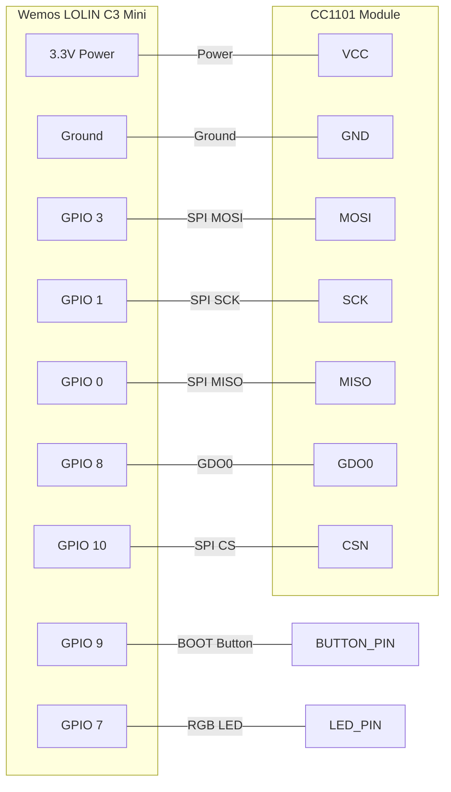
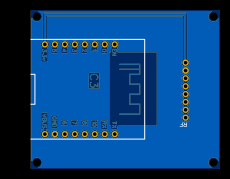
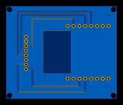
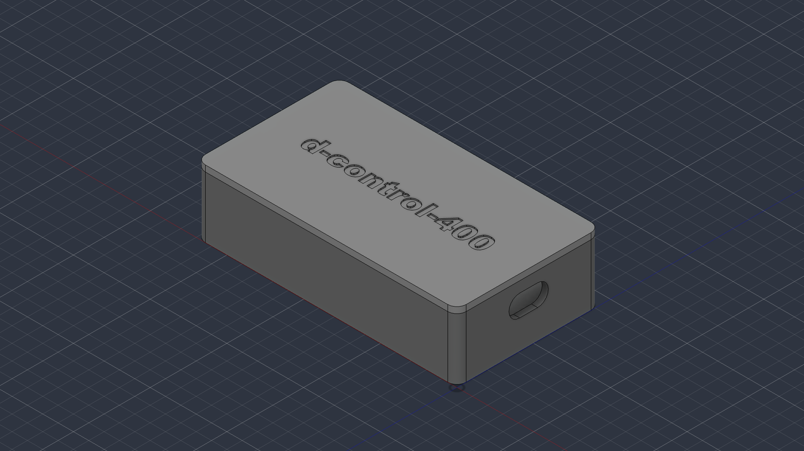
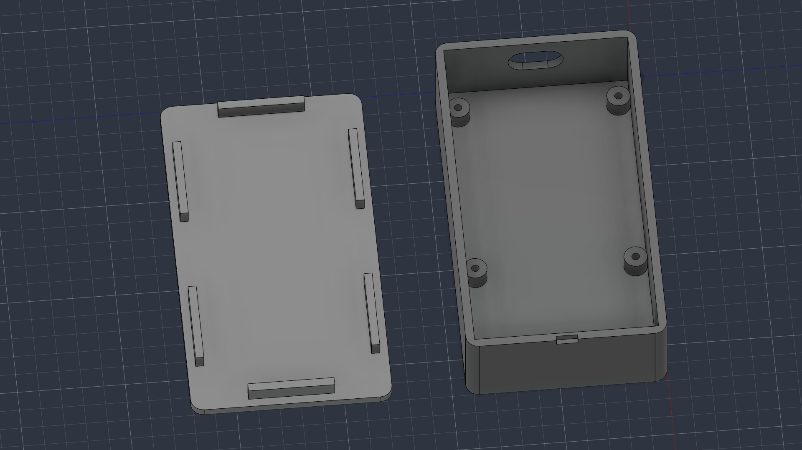

# Dogtrace d-control 400 remote clone (ESP32-C3 + CC1101)

A small ESP32-C3 board that reproduces the *beep* command of a Dogtrace d-control 400 dog collar, making it triggerable from Home Assistant rather than only from the handheld remote.

The repository contains everything needed to build one: firmware for two runtimes (bare PlatformIO, and ESPHome for the Home Assistant path), a fabrication-ready PCB, a 3D printable enclosure, the SDR analysis script, and a written account of how the radio link was measured and decoded.

⚠️ **Scope and disclaimers**

* **Undocumented protocol.** Dogtrace publishes nothing about the link. Everything here was measured from SDR captures. The frame has since been decoded far enough to describe its structure — see [What the frame looks like](#-what-the-frame-looks-like) — but the firmware **does not use that decode**. It still replays a stored payload verbatim.
* **Raw replay, not synthesis.** The transmitted signal is a fixed-code payload captured with an SDR, cleaned up and re-emitted as raw timings, clocked onto the CC1101's GDO0 pin by the ESP32-C3's RMT peripheral in asynchronous direct mode: no packet engine, no sync word, no CRC. The encoding is **run-length** — all the information is in the durations and none in the levels. It is *not* PWM, despite what earlier revisions of this file claimed: PWM would need exactly half the runs long, and a real frame has 21 long runs out of 88.
* **Device specific.** The payload committed here was captured from one physical remote and is not a universal key for every d-control 400. The 68 runs that stay constant across everything that handset can send are *assumed* to be its identity — an assumption that has never been tested, because testing it needs a second remote. See [What the frame looks like](#-what-the-frame-looks-like). What this repository gives you is a structural template; you supply your own captured frame.
* **A fresh clone does not compile.** `include/signal.h` in this repository is encrypted, so it is not valid C. Replace it with your own capture using the template in [Providing your own signal](#-providing-your-own-signal).
* **Beep only.** The shock function is deliberately out of scope. As of the September 2026 decode that is a policy rather than a limitation: the frame is understood well enough to construct a shock command, and this repository deliberately does not carry what would be required to build one.
* **Legal.** 868 MHz is a licence-exempt band in Europe with duty-cycle limits, and transmitting on it is your responsibility. So is anything you do with a device that talks to an animal's collar.

---

## 📺 Demo

Demonstration of the project triggering the collar's sound beep function.


<div align="center">
  <video src="https://github.com/user-attachments/assets/95b2df5f-6e3d-44ce-ad21-af88bca1a0c2" controls="controls" style="max-width: 100%;">
  </video>
</div>


> **Note:** The video contains sound

---

## 📁 Repository Structure

```
.
├── src/main.cpp          # Standalone firmware — button, LED, TX sequence, serial console
├── include/
│   ├── pinout.h          # Pin map for the custom SPI routing on the C3
│   └── signal.h          # RF parameters + captured payload — ENCRYPTED, see below
├── esphome/              # Home Assistant path: d-control-400.yaml + cc1101.h
├── tools/analyze_capture.py  # IQ → envelope → run lengths → base tick → frame → encoding tests
├── signal_captures.txt   # Decoded-frame worksheet — ENCRYPTED, not a build input
├── pcb/
│   ├── gerber.zip        # Fabrication-ready Gerbers
│   └── board-outline.dxf # Board outline, holes and pads in mm — for enclosure CAD
├── enclosure/            # Fusion 360 source + STEP + STL/3MF
├── doc/                  # Demo video, enclosure photos, PCB layer views
├── .githooks/            # Commit guard that keeps the two encrypted files encrypted
├── platformio.ini        # PlatformIO project/build configuration
└── README.md
```

`test/`, `lib/` and `include/README` are empty PlatformIO scaffolding. There are no tests.

The two encrypted files are the author's own captured data and are explained in [Encrypted files](#-encrypted-files-and-the-commit-guard). Nothing in the build reads `signal_captures.txt`.

---

## 🧰 Hardware Requirements

* **Microcontroller:** Wemos LOLIN C3 Mini (ESP32-C3, single-core RISC-V, USB-C).
* **Radio:** CC1101 transceiver module — must be the **868 MHz** variant with a **26 MHz** crystal. The 433 MHz part will not reach 869.525 MHz.
* **Antenna:** 868 MHz quarter-wave, roughly 8.2 cm.
* Optional: the PCB in `pcb/` and the printed enclosure in `enclosure/`. Hand-wiring on perfboard works just as well.

---

## 🔌 Wiring Diagram

The project uses a custom SPI bus routed to specific pins on the ESP32-C3. The physical BOOT button on GPIO 9 is used to trigger the transmission.


```mermaid
graph LR
    subgraph Wemos LOLIN C3 Mini
        3V3[3.3V Power]
        GND[Ground]
        G3[GPIO 3]
        G1[GPIO 1]
        G0[GPIO 0]
        G8[GPIO 8]
        G10[GPIO 10]
        G9[GPIO 9]
        G7[GPIO 7]
    end

    subgraph CC1101 Module
        VCC_C[VCC]
        GND_C[GND]
        MOSI[MOSI]
        SCK[SCK]
        MISO[MISO]
        GDO0[GDO0]
        CSN[CSN]
    end

    3V3 ---|Power| VCC_C
    GND ---|Ground| GND_C
    G3 ---|SPI MOSI| MOSI
    G1 ---|SPI SCK| SCK
    G0 ---|SPI MISO| MISO
    G8 ---|GDO0| GDO0
    G10 ---|SPI CS| CSN
    G9 ---|BOOT Button| BUTTON_PIN
    G7 ---|RGB LED| LED_PIN
```

Only **GDO0** is wired. Asynchronous direct mode maps that pin's logic level straight onto the power amplifier, so it is the entire data path; GDO2 is left unconnected.

---

## 🧩 PCB

A fabrication-ready two-layer board is included at `pcb/gerber.zip`. It routes the SPI bus and control pins between the LOLIN C3 Mini and the CC1101 module exactly as shown above. Upload the zip to any fab house (JLCPCB, PCBWay, OSH Park) as-is. It is optional — hand-wiring per the diagram is a fully valid alternative.

| Top | Bottom |
| :---: | :---: |
|  |  |

The dark rectangle sitting under the C3's antenna is the pour keepout, and it is visible on both views because it is cut through both layers. The bottom view is mirrored, as seen through the board.

`pcb/board-outline.dxf` carries the same geometry in millimetres — board outline, every drilled hole (24 plated, 4 mounting), pad positions and the module footprints, each on its own DXF layer. It is there so the mechanical side can be worked without opening an EDA tool: import it as a sketch in Fusion 360, FreeCAD or anything else that reads DXF, and build a case, a mounting plate or a panel cutout straight off the real dimensions.

**Layout**

* **Module placement.** The two modules sit at opposite ends of the board. The CC1101 is positioned so its antenna overhangs the board edge completely, with no substrate underneath to detune or absorb it. The C3 Mini is at the other end with its USB-C connector overhanging that edge, where the enclosure cutout reaches it — but its own antenna cannot be given the same treatment, because it falls close to the centre of the board, over laminate and copper pour. That is what the keepout below is for.
* **ESP antenna keepout.** A copper-pour keepout sits under the ESP32-C3's onboard antenna on **both** layers, so the antenna radiates through bare laminate rather than over a ground plane. It is a rectangle roughly 12 mm wide that extends about 3 mm past the end of the module, so the fringing field clears the pour as well as the antenna trace itself.
* **Mounting holes.** 2.032 mm at the corners, with the pour pulled back for clearance around the hardware.
* **Radio footprint.** The CC1101 header is 1×8 on a 2.00 mm pitch (`header-pin-1x8-2.00`), verified against the module.

**Routing**

* Power traces from the 3.3 V rail are 0.5 mm; signal traces are 0.254 mm.
* Ground pins tie into a full-coverage polygon pour through thermal reliefs, so the ground is solid but the pads still take a hand-soldering iron.
* DRC minimum track width was tuned to the design and the board passes cleanly.

**Ordering**

Fab defaults are fine for everything except board thickness: order **1.6 mm**, which is what the enclosure's standoffs are dimensioned for. The 0.5 mm power trace assumes 1 oz copper. Everything else — material, surface finish, mask colour — is free choice; the photographed board is black with leaded HASL because it was hand-assembled with leaded solder.

---

## 📡 CC1101 RF Configuration Summary

Only the carrier frequency comes from a datasheet. The rest were derived from SDR measurement and iterative testing against the collar.

| Parameter | Value | Why it matters |
| :--- | :--- | :--- |
| Carrier frequency | 869.525 MHz | The frequency the collar listens on. Confirmed on an SDR waterfall. |
| Output power | 10 dBm | Enough for whole-house range; see the note on chopping at range below. |
| Modulation | OOK | Confirmed on the waterfall — the carrier is simply gated on and off. |
| Bit rate | 100.0 kbps | Deliberate ~20× oversampling of a ~4.8 kBaud signal. Not a mistake — see below. |
| Rx bandwidth | 116.0 kHz | Selects a stable hardware filter tap off the 26 MHz crystal, on a transmit-only device. Not dead config. |
| Sync word | Disabled | Raw pulses; the packet engine is bypassed entirely. |
| Preamble / CRC | Disabled | Same reason — asynchronous direct mode. |
| Transmission mode | Asynchronous direct | GDO0's logic level maps straight to the PA. HIGH = RF on, LOW = RF off. |
| Symbol period | 208.647 µs (stored as `209`) | Measured, not rounded. Every run is one or two of these. See [Measuring the symbol period](#measuring-the-symbol-period). |

---

## 🚀 Technical Specifics

### 1. 20× bitrate oversampling

A symbol period of 208.647 µs is a signalling rate of about 4.8 kBaud, yet the CC1101's data rate register is set to 100 kbps.

That is deliberate. In asynchronous mode the CC1101 samples the GDO0 pin on its own internal clock derived from that register. Set to 4.8 kbps it would look at the pin roughly once per symbol, and every edge would land wherever the two clocks happened to be relative to each other — visible as heavy jitter on the gating of the power amplifier. At 100 kbps it samples about every 10 µs, roughly 20 times per symbol, so each edge is reproduced to within a twentieth of a symbol. Do not "fix" this to match the real baud rate.

### 2. Receive bandwidth on a transmit-only device

`RX_BANDWIDTH` looks like dead configuration, and it is not. The CC1101 derives its channel filter from a chain of dividers off the 26 MHz crystal, and the register selects which tap. 116.0 kHz picks a tap that divides cleanly, which keeps the internal clock tree — and therefore the shape of the transmitted bursts — stable. In OOK the synthesiser stays parked at 869.525 MHz regardless.

### 3. Clocking the waveform out of hardware

The ESP32-C3 is a single-core RISC-V part running FreeRTOS, so a CPU-generated waveform is at the mercy of every other task: a preemption mid-frame stretches a run by however long the other task took. The firmware used to answer that with `vTaskSuspendAll()` around each burst. It worked, and it cost a great deal — the scheduler had to be released periodically or the task watchdog fired (a 159 ms burst followed by a 5 ms gap rebooted the ESPHome build with `ESP_RST_TASK_WDT`), and the release had to be brief or the beep audibly chopped.

The waveform is now clocked out by the **RMT** peripheral — Remote Control Transceiver, built for exactly this class of signal and already driving the WS2812 status LED. The 88-run frame is packed into the channel's own memory as 44 words of two level-plus-duration entries each, and the hardware loops it for as many frames as the beep needs. The CPU's entire involvement is one `rmt_transmit()` call that returns immediately; the transmission ends in an interrupt.

Three constraints disappear together: no scheduler suspension, no watchdog exposure, and no gap. A beep is one genuinely continuous transmission for its whole duration, which is what holding the original remote's button produces and what the bit-banged version could not do at all.

What replaces them is a shorter list of facts about the peripheral, all of which are properties of the RMT group rather than of this firmware:

* **The clock source and the prescale belong to the group, not the channel.** The first channel created fixes both for every later one. On this board that first channel is normally the status LED, which asks for `RMT_CLK_SRC_DEFAULT` — APB on the C3 — so the radio channel asks for APB explicitly rather than relying on init order. A mismatch is a hard `ESP_ERR_INVALID_ARG`, "group clock conflict", not a silent fallback. Both firmware paths therefore run the same divider of 214, a channel tick of exactly 2.675 µs, and emit a bit-identical waveform.
* **There are two TX-capable channels and 48 words of memory each.** The LED holds one, the radio the other, with nothing spare. Under ESPHome the LED must be pinned with `rmt_symbols: 48`, because the default on the C3 is 96 — two blocks — and a two-block channel claims its neighbour's, leaving the radio nowhere to go.
* **The C3 has no loop auto-stop.** `SOC_RMT_SUPPORT_TX_LOOP_COUNT` is defined, `SOC_RMT_SUPPORT_TX_LOOP_AUTO_STOP` is not, so reaching the frame count raises an interrupt and the driver stops the channel from its own ISR. A few entries can still reach the air after the target, which truncates the last frame rather than dropping it — the same thing the real remote does when the button is released. GDO0's resting level is forced from a register (`eot_level`, which the driver also writes to `RMT_IDLE_OUT_LV`) rather than taken from the end marker, so even an abort mid-frame leaves the pin low and the carrier off.

### 4. Contiguity — the property that decides whether it works at all

This is the single most important property of the transmission, and the least obvious.

**Frames are emitted back-to-back with no silence between them.** The original remote never inserts a gap mid-transmission: a tap is 7 contiguous frames (~159 ms) and a ~4.1 s hold is ~180 contiguous frames, with no OFF period longer than two symbol periods anywhere inside either. Verified across three captures and 13 presses.

This is not a detail. A firmware build that sent **one** frame followed by a 5 ms gap produced **zero** beeps, while an earlier, badly mistimed payload that happened to pack about 2.5 frames into each burst worked around 70% of the time. Two receiver behaviours explain it, and both demand contiguity:

* **Consecutive-frame validation** — cheap fixed-code decoders confirm a frame by requiring the next one to arrive and match before a timer expires. A gap expires that timer on every frame.
* **AGC settling** — a few milliseconds without carrier lets the receiver's gain drift toward the noise floor, corrupting the start of the next frame, which is exactly where the preamble lives.

Under RMT contiguity is free rather than bought, so the three layered knobs the bit-banged firmware needed — contiguous frames per burst, silence between bursts, number of bursts — collapse into one:

| Macro | Meaning | Bounded by |
| :--- | :--- | :--- |
| `BEEP_DURATION_MS` | How long the beep lasts | The RMT loop counter: ten bits, so 1023 frames — about 23 s — in one batch |

The other two are gone because nothing in the protocol ever wanted them. Both existed only because the CPU cannot hold `vTaskSuspendAll()` indefinitely, so a long transmission had to be chopped into pieces with scheduler windows between them; the gap in particular was a ceiling on damage (5 ms inaudible, 30 ms audibly chopping) rather than a value with a right answer. The evidence that the receiver never needed them was already in hand before the migration: with the gap set to zero at runtime on the standalone path, 126 frames ran back-to-back over 2.87 s — the shape of a real button hold — and decoded 6/6.

That the payload's run count is **even** is what makes the hardware loop legal, and it is a property of the frame rather than a convenience. Each RMT word holds two entries, so 88 runs is exactly 44 words with no half-filled tail; and because the frame starts ON and ends OFF, each repeat begins with a real OFF→ON edge instead of two same-level runs merging at the seam. The peripheral replays each entry's stored level bit verbatim and never enforces alternation, so an odd-length frame could not be looped out of a single block at all.


---

## 📻 What the frame looks like

Decoded in September 2026 from a differential capture campaign — beep and shock, channels A and B, all 20 shock levels, 42 distinct frames extracted from raw IQ and cross-checked against hand measurements in Universal Radio Hacker.

Every frame this handset sends is **88 runs** of one or two symbol periods (T = 208.647 µs), and the encoding is **run-length**: the levels carry no information at all, because two adjacent runs at the same level would merge into one. Everything is in the durations. That rules out NRZ, Manchester, PWM and PPM outright, and `periods = 88 + (number of long runs)` holds as an identity on every frame measured — 109 periods for a beep, 22.7 ms of air time.

The frame boundary is found on durations alone: a frame is the 88 runs beginning at the **last 31 unit runs before a double**. Anchoring instead on the start of the visible alternating stretch does not work, because that stretch is the preamble plus the tail of the previous frame and its length depends on the data.

Of the 88 runs, **68 are identical across everything the handset transmits** — both functions, both channels, all 20 intensity levels. The remaining 20 carry the whole command surface. Writing `A` for a short run and `B` for a long one:

```
run     field
0-30    preamble          31 short runs
31-44   constant          handset-specific
45-46   channel           AB = channel A,  BA = channel B
47-66   constant          handset-specific
67-68   function          AB = beep,       BA = shock
69-70   constant          handset-specific
71-78   level             8 runs, MSB first, long = 1
79-86   redundancy        run 79+i against run 71+i:
                            i = 0..3   always complement
                            i = 4,5    complement = shock, copy = beep
                            i = 6,7    (complement, copy) = channel A
                                       (copy, complement) = channel B
87      constant          always short
```

The redundancy block is the interesting part, and it is not a checksum. It is the level field re-emitted through a mask: four of its eight positions always invert the original, and the other four invert or copy depending on which channel and which function is being sent. Each command field is therefore stated twice — once outright in its own runs, and once as a perturbation of the redundancy. A receiver that validates the two halves against each other reads the command out of the comparison itself, which buys error detection and addressing from the same bits.

Neither the channel nor the function field ever uses `AA` or `BB` — only the two transposed values. That admits two readings the captures cannot separate, since there are only two observations of each field: either they are two-bit fields with two states spare, leaving room for two more functions and two more channels, or they are one-bit fields in a balanced 1-of-2 code where `AA` and `BB` are invalid codewords and there is no headroom at all. The d-control range includes models with more channels, so a higher model in the family would settle it.

The level field takes 20 distinct values across the 20 dial positions, read MSB first as an 8-bit number. That sequence is monotone and strongly non-linear, and no formula has been recovered from it. What the value *means* is unknown: nothing here establishes whether it is a physical quantity or simply an opaque index, and RF capture alone cannot say.

**What is published here and what is not.** The schema above is a property of the protocol, discoverable by anyone with this model and an SDR, so it is written down. The 68 constant runs and the level-to-value table are one specific handset's identity, and they are the only thing that makes a frame *this* remote's; those stay encrypted.

### The open question behind the "device specific" disclaimer

The 68 constant runs are *assumed* to be this handset's identity, and that assumption has never been tested. All that has been shown is that they are constant under every axis a single handset can vary, which is a much weaker claim. **Settling it requires a second remote** — nothing captured from this one will do it. Diffing two handsets splits the constant block into what differs (identity) and what agrees (protocol framing), with one confounder worth designing for in advance: two remotes may also differ by firmware revision, since each remote and collar ships as a pair. A third handset disambiguates, and so does the shape — an identifier is likely one contiguous field, a revision counter likely sits apart and takes small values.

---

## 🔑 Providing your own signal

`include/signal.h` holds both the RF parameters and the captured payload, and **the copy in this repository is encrypted**, so a fresh clone will not compile. To build the project you replace it with a header describing your own remote.

Capture the signal from the remote you want to clone with an SDR in AM/ASK mode, extract the run lengths, and write them into the file below.

The payload is stored as **run lengths in symbol periods**, not absolute microseconds. Every element is a whole number of `SYMBOL_TICKS` RMT channel ticks, so the entire frame is parameterised by that one number. Keep it that way — it is what allows the symbol period to be swept at runtime without re-deriving the payload.

```cpp
#pragma once

#define CARRIER_FREQUENCY 869.525 // Carrier frequency in MHz
#define OUTPUT_POWER 10           // CC1101 transmit power in dBm
#define BIT_RATE 100.0            // Async oversampling rate in kbps
#define RX_BANDWIDTH 116.0        // Receiver filter bandwidth in kHz

#define BEEP_DURATION_MS 3000     // How long the collar beeps. The firmware rounds this
                                  // to a whole number of frames and loads that into the
                                  // RMT loop counter, which tops out at 1023 (~23 s).

#define SYMBOL_TICKS 78           // Symbol period, in RMT channel ticks
#define RMT_RESOLUTION_HZ 373832  // Requested channel tick rate. The driver rounds to the
                                  // nearest integer divider -- 214 off an 80 MHz group
                                  // clock, a 2.675 us tick, so T = 78 x 2.675 = 208.65 us.

// Replace the numbers below with your captured run lengths, in symbol periods.
// Positive = RF ON (GDO0 HIGH), negative = RF OFF.
// Absolute duration of element i is T * abs(SIGNAL_BEEP_TICKS[i]).
#define SIGNAL_BEEP_TICKS { \
  1, -1, 2, -2, 1, -1, ... \
}
```

> **Note:** Keep every macro above. Both firmware paths require all of them and neither will compile without them.

Two properties of `SIGNAL_BEEP_TICKS` are checked at compile time, because the RMT cannot loop a frame that violates either:
>
> * **An even number of runs.** Each RMT word holds two entries, and the peripheral replays each entry's stored level bit verbatim rather than enforcing alternation, so an odd-length frame would put two same-level runs against each other at the loop seam and merge them.
> * **At most 94 runs.** That is 47 words, leaving room for the one word the driver appends as the end marker inside a 48-word channel block. Loop mode cannot refill the block as it plays, so the whole frame has to be resident.
>
> If your remote's frame is longer than 94 runs, the RMT path cannot loop it out of one block and the design needs revisiting rather than a bigger constant.

### Getting the numbers out of a capture

`tools/analyze_capture.py` takes the whole pipeline — IQ file to envelope to run lengths to base tick to frame boundaries to encoding tests — and is the fastest way to a first answer. Two things are worth doing anyway:

* **Measure a dozen short and long pulses by hand first**, and check the script against them rather than the other way round. The script was validated against synthetic captures with known ground truth before it was ever pointed at real data, and that caught three bugs in it, any one of which would otherwise have read as a property of the signal.
* **Capture several presses in one recording.** Cutting the result at the frame period and checking the copies are byte-identical costs nothing, needs no external ground truth, and catches errors in the crop, the sample rate, the symbol slot, the threshold and the frame boundary long before any of them are visible by eye.

Two capture-side traps are worth naming, because both cost a session here:

* **Tune off-centre.** The RTL2832U places a DC spike at whatever frequency it is tuned to, so a carrier captured dead centre sits under an artefact that is not in the air. The 869.525 MHz signal was captured at 869.275 MHz — 250 kHz low.
* **Turn the gain down.** With the remote held close and the gain up, the waterfall showed three marks, not one: the real burst, its I/Q image mirrored about the tuned centre, and a third-order intermodulation product at roughly three times the baseband offset. The test that separates them is to retune and see what moves — real transmissions stay put on an absolute axis, images and distortion products follow your tuning. Use manual gain, not AGC, so nothing modulates the amplitudes you are trying to measure.

### Measuring the symbol period

Everything else falls out of the symbol period, so it is the one number to measure rather than estimate. **Take it frame-start to frame-start**: the rising edge that opens one frame against the rising edge that opens a frame several repeats later, divided by the number of symbol periods between them. Here that was 272 910 samples across exactly 654 periods at 2.000 MSps — 417.294 samples per period, or **208.647 µs**, with the six intermediate estimates agreeing to within 0.02%.

Two properties of that baseline are what make it trustworthy, and both are about the endpoints rather than the span:

* Both endpoints are **rising edges at the same structural position**, so rise-time bias is identical at each end and cancels instead of accumulating. Measuring edge-to-edge across a single pulse biases high by the rise and fall time.
* **The period count is known exactly.** A press ends when the button is released, which truncates the final frame at an arbitrary point, so the total period count of a whole message is not knowable and dividing by it is guesswork. Two frame starts sidestep that.

⚠️ Do not let a tool fit the symbol length for you. URH's *Autodetect parameters* reports 400 samples/symbol on this signal — wrong by 9%.

---

## 🔒 Encrypted files and the commit guard

Two files in this repository are encrypted with [SOPS](https://github.com/getsops/sops) and age:

| File | What it is |
| :--- | :--- |
| `include/signal.h` | RF parameters and the captured payload for the author's own remote |
| `signal_captures.txt` | The decoded-frame worksheet — the 68 constant runs and the level-to-value table |

This is a personal choice about the author's own captured data, not a build system. **You do not need SOPS, an age key, or any of this to use the project** — you need your own `signal.h`, written from the template above. `signal_captures.txt` is not a build input; nothing includes it.

What *does* affect anyone working in this repository is `.githooks/pre-commit`, which is committed. It refuses any commit that stages either file in plaintext, and warns when either is sitting decrypted in the working tree. It inspects the **staged blob** rather than the file on disk, and detects encryption by looking for SOPS's own markers, so it needs no key and works fine on a machine that cannot decrypt anything. Enable it with:

```bash
git config core.hooksPath .githooks
```

One wrinkle worth knowing if you have global hooks: a repository-local `core.hooksPath` **replaces** the global one rather than adding to it, so enabling the guard would silently stop your global hooks from running. `.githooks/prepare-commit-msg` exists to chain through to the global directory, with a re-entry guard — because a global hook that chains the other way resolves the repo's hook via `core.hooksPath`, lands back on the shim, and forks until the process table fills.

---

## 🛠️ Software Setup

Built with [PlatformIO](https://platformio.org/). Dependencies (RadioLib for the CC1101, Adafruit NeoPixel for the status LED) are pinned in `platformio.ini` and fetched automatically.

1. Write your own `include/signal.h` as described above.
2. Connect the LOLIN C3 Mini over USB.
3. Build and flash:

```bash
pio run                                      # build only
pio run --target upload                      # flash
pio run --target upload --target monitor     # flash and open the serial console at 115200
```

No port is configured in `platformio.ini`. The board declares USB VID/PID `303A:1001`, so PlatformIO finds it automatically; if several Espressif boards are attached, pass one explicitly:

```bash
pio run -t upload --upload-port /dev/cu.usbmodem101
```

On macOS prefer `/dev/cu.*` over `/dev/tty.*` — the latter blocks on open waiting for a carrier-detect signal that a USB CDC device never asserts.

---

## 🚥 Status Indication

The onboard RGB LED reports the device state:

* 🟢 **Green, 0.5 s once at boot:** CC1101 initialised successfully.
* 🟢 **Green pulse, 80 ms every 5 s:** liveness heartbeat — powered, running, radio OK.
* 🟠 **Amber pulse, 80 ms every 5 s** *(ESPHome path only)*: alive and radio OK, but **Wi-Fi is down**.
* 🔴 **Solid red, never pulsing:** radio initialisation failed — check the SPI wiring.
* 🔵 **Solid blue:** transmitting. The heartbeat is suppressed for the duration.
* ⚫ **Off:** no power, or the firmware has crashed.

The heartbeat exists so that idle is distinguishable from dead. On the ESPHome path its colour encodes the Wi-Fi state because nothing else can: a device with a dropped link is alive and transmits fine but is invisible to Home Assistant *and* to `esphome logs`, so the LED is the only witness — a plain green pulse there would be a false all-clear in exactly the failure mode where you walk over and look at the board. And because the heartbeat is gated on the radio being ready, a board sitting solid red and never pulsing has exactly one problem rather than two.

---

## 🎮 Usage

1. Power the board and check for the green flash — CC1101 initialised.
2. Confirm the green heartbeat every 5 seconds. That is the device reporting it is alive and idle.
3. Press the BOOT button. The LED turns blue for the transmission (~3 s), then returns to the heartbeat.

---

## 🎛️ Serial Console

The standalone firmware exposes its RF parameters over the serial monitor (115200 baud) so they can be changed without reflashing. Nothing is persisted — a reset restores whatever was compiled in from `signal.h`.

| Command | Effect |
| :--- | :--- |
| `k <ticks>` | Symbol period, in RMT channel ticks (`SYMBOL_TICKS`; 78 = 208.65 µs, one step is 1.28%) |
| `d <ms>` | Beep duration |
| `p <dBm>` | Output power |
| `f <MHz>` | Carrier frequency |
| `t` | Transmit one beep |
| `?` | Print current state and the computed frame duration, frame count and beep length |

It exists so that a new capture can be brought in without a reflash between trials, which is the situation these parameters are actually uncertain in. The values committed here are already settled, so nothing needs sweeping on a working build.

When bringing up your own signal, the useful diagnostic is that the two common faults look different: a wrong symbol period produces *intermittent* triggering, a wrong frame structure produces *none at all*. If the collar never responds, check the payload and the run count before touching the timebase — no amount of sweeping will find that fault.

`k` and `d` are refused while a beep is in flight, and either is refused if the result would not fit the hardware: a symbol period whose long run overflows the RMT's 15-bit duration field, or a beep longer than one 1023-frame batch.

---

## 🖨️ 3D Printed Enclosure

`enclosure/` contains parametric CAD and ready-to-print files for a case that houses the assembled board. The design prints without supports and uses a friction fit to hold the lid.

| Closed | Open |
| :---: | :---: |
|  |  |

| File | Format | Purpose |
| :--- | :--- | :--- |
| `d-control-400-remote-enclosure.f3d` | F3D | Fusion 360 source, with full timeline and sketches |
| `d-control-400-remote-enclosure.step` | STEP | Universal CAD model, useful for collision checks in EDA software |
| `d-control-400-enclosure.3mf` | 3MF | PrusaSlicer project with orientation and print profiles preset |
| `d-control-400-case.stl` | STL | Case body mesh |
| `d-control-400-lid.stl` | STL | Lid mesh |

**Recommended print settings (Prusa MK4)**

* **Material:** PLA
* **Profile:** `0.20mm STRUCTURAL (Input Shaper)` — needed to hold the −0.1 mm friction-fit tolerance
* **Nozzle:** 0.4 mm
* **Supports:** none. The 13×7 mm USB-C cutout is sized so the printer bridges it cleanly
* **Orientation:** case flat on the plate; lid outer face (with the recessed text) on the plate for a smooth finish

The lid slides in until seated and is held by the interference fit. A hidden pry slot with an internal fillet sits on the top edge of the rear wall — insert a 5 mm flat-head screwdriver and lever the lid off.

---

## 🏠 ESPHome / Home Assistant

`esphome/` contains a complete ESPHome configuration that exposes the beep as a template switch, keeping the BOOT button working as a manual trigger. See [`esphome/README.md`](esphome/README.md) for setup; you will need to create `esphome/secrets.yaml` with your Wi-Fi credentials and an API encryption key.

```bash
cd esphome
esphome config d-control-400.yaml                              # validate
esphome run d-control-400.yaml                                 # compile + flash over USB
esphome run d-control-400.yaml --device d-control-400.local    # OTA
esphome logs d-control-400.yaml
```

Both firmware paths share `include/pinout.h` and `include/signal.h`, so a change to RF behaviour usually has to land in both. The behavioural differences between them are deliberate and documented in `esphome/CLAUDE.md`.

Wi-Fi transmit power is capped at 8.5 dBm in the YAML. That is a hardware fix for LDO brownout on the C3 Mini's regulator, not a tuning preference — do not raise it.

> **Note:** the status LED can be exposed to Home Assistant by removing `internal: true` from the `status_led` component.

⚠️ Triggering an animal's collar from an automation without a physical confirmation step is a bad idea. The switch is there so a person can press it from a phone.

---

## 🧭 Possible future improvements

### Measure what the loop seam costs

Continuous TX mode restarts from the first entry when it meets the end marker, and the reference manual says only that the transmitter "starts transmitting the first data again" — it does not say whether the jump back adds any output time. Any plausible answer is small, and a decode cannot see it: the decoder rounds every run to one or two symbol periods, so a final run stretched by anything under half a symbol (104 µs, 39 channel ticks) reads identically to a perfect seam.

The measurement that can see it is the one the symbol period came from — frame start to frame start, rising edge to rising edge at the same structural position — comparing a span that crosses a seam against one that does not. A rate error and a per-seam stretch both add a constant per frame, which is why the two spans are needed rather than one. It is a fact about the chip worth having for anything that later loops RMT output, and it changes nothing about whether this device works.

---

## 📄 License

MIT — see [LICENSE](LICENSE). The software is provided "as is", without warranty of any kind. Use it responsibly and at your own risk, with the disclaimers at the top of this document in mind.
