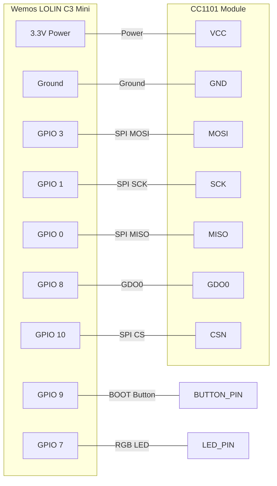

# Dogtrace d-control 400 remote clone (ESP32-C3 + CC1101)

This project replicates the control signal for a Dogtrace d-control 400 electric dog collar using a Wemos LOLIN C3 Mini (ESP32-C3) and a CC1101 transceiver module. The main goal of this project is to create a remote that can be triggered remotely (e.g., via Home Assistant). Integration with Home Assistant is possible through the included ESPHome configuration, allowing for remote triggering of the collar's sound beep function. The project is structured around a single button press (the BOOT button) that triggers the transmission of a raw RF signal captured from the original remote.

⚠️ IMPORTANT PROJECT SCOPE & DISCLAIMERS:
* Unknown Protocol: The underlying communication protocol is not publicly available, so the precise byte frame to be used, the exact RF parameters, sync word, or checksum logic used by Dogtrace is unknown. This project does not attempt to reverse engineer the protocol or implement a true "clone" of the remote.
* Raw Replay: The signal transmitted by this code is a raw, fixed-code payload meant to be captured using an SDR, cleaned up, fine-tuned, and repeated. The RF parameters used here are fine-tuned to work, but may not be the exact parameters used by the original remote. The signal is transmitted via bit-banging asynchronous timings, mimicking the original system's Pulse Width Modulated (PWM) bit-stream without requiring formal protocol decoding.
* Device Specific & Template Only: The original signal used to develop this project was specific to my personal remote. It is not a universal signal for all Dogtrace d-control 400 remotes, as each remote likely has a unique identifier embedded in the signal to prevent cross-interference. Instead, this code provides a structural template. To replicate a new remote, its signal has to be captured using an SDR, the timings have to be extracted and cleaned up, and then injected into the code as described in the "Adding Custom Signal" section below.
* Beep Only: This repository is currently structured around the sound beep function. It could easily be extended to include the shock function by capturing that specific button press, but that is not the scope of this project at the moment.

---

## 📺 Demo

Demonstration of the project triggering the collar's sound beep function.


<div align="center">
  <video src="https://github.com/user-attachments/assets/95b2df5f-6e3d-44ce-ad21-af88bca1a0c2" controls="controls" style="max-width: 100%;">
  </video>
</div>


> **Note:** The video contains sound

---

## 📁 Repository Structure

```
.
├── src/          # Firmware source (main.cpp — button handling, LED feedback, TX sequence)
├── include/      # Headers: pinout.h (pin map) and signal.h (RF params + captured payload, encrypted)
├── esphome/      # ESPHome configuration for Home Assistant integration
├── pcb/          # Fabrication-ready PCB Gerber files (gerber.zip)
├── enclosure/    # 3D printable enclosure models (CAD sources + STL/3MF)
├── doc/          # Media assets (demo video)
├── platformio.ini # PlatformIO project/build configuration
└── README.md
```

---

## Hardware Requirements
* Microcontroller: Wemos LOLIN C3 Mini (ESP32-C3).
* Radio: CC1101 Transceiver Module (Must be the 868 MHz version, 26 MHz crystal).
* Antenna: 868 MHz tuned antenna (~8.2 cm quarter-wave).

---

## 🔌 Wiring Diagram

The project uses a custom SPI bus routed to specific pins on the ESP32-C3. The physical BOOT button on GPIO 9 is used to trigger the transmission.


```mermaid
graph LR
    subgraph Wemos LOLIN C3 Mini
        3V3[3.3V Power]
        GND[Ground]
        G3[GPIO 3]
        G1[GPIO 1]
        G0[GPIO 0]
        G8[GPIO 8]
        G10[GPIO 10]
        G9[GPIO 9]
        G7[GPIO 7]
    end

    subgraph CC1101 Module
        VCC_C[VCC]
        GND_C[GND]
        MOSI[MOSI]
        SCK[SCK]
        MISO[MISO]
        GDO0[GDO0]
        CSN[CSN]
    end

    3V3 ---|Power| VCC_C
    GND ---|Ground| GND_C
    G3 ---|SPI MOSI| MOSI
    G1 ---|SPI SCK| SCK
    G0 ---|SPI MISO| MISO
    G8 ---|GDO0| GDO0
    G10 ---|SPI CS| CSN
    G9 ---|BOOT Button| BUTTON_PIN
    G7 ---|RGB LED| LED_PIN
```
---

## 🧩 PCB

For a cleaner build than hand-wiring, a fabrication-ready PCB is included at `pcb/gerber.zip`. It routes the SPI bus and control pins between the Wemos LOLIN C3 Mini and the CC1101 module exactly as shown in the wiring diagram above.

* Upload `pcb/gerber.zip` directly to any PCB fab house (JLCPCB, PCBWay, OSH Park, etc.) to have the boards manufactured.
* Hand-wiring per the diagram above remains a fully valid alternative — the PCB is optional.

### Layout & Components
* **Module placement:** The Lolin C3 Mini and the CC1101 RF module are placed strategically so the RF module's antenna overhangs completely past the edge of the board, giving it clear space to radiate without the board substrate detuning or absorbing the signal.
* **ESP antenna optimization:** A deliberate copper-pour keepout was created under the ESP32's onboard antenna on **both** layers, eliminating interference and letting it transmit through clean laminate.
* **Mounting holes:** The corners carry mounting holes with a precise **2.032 mm** diameter; the copper pour flows around them with a safety clearance to prevent shorts from mounting hardware.
* **Verified footprint:** The radio's pin pitch was designed and verified at 2.00 mm (matching the `header-pin-1x8-2.00` standard).

### Routing & Electrical Integrity (DRC)
* **Differentiated track widths:** The power trace (from the 3.3V pin) is deliberately sized to **0.5 mm** for better current capacity and stability, noticeably wider than the data/signal traces, which are a precise **0.254 mm**.
* **GND net integrity:** Ground pins connect to a full-coverage copper polygon pour via thermal reliefs — ensuring a solid ground connection while still making the pads easy to hand-solder.
* **CC1101 asynchronous mode:** For asynchronous signal transmission only the **GDO0** pin is wired and used; GDO2 is left unconnected.
* **Design Rule Check:** The manufacturing rules for minimum track width were tuned to the actual design so the board passes automated DRC cleanly.

### Manufacturing / Gerber Parameters
* **Export:** Standard Gerber files, provided as `gerber.zip`.
* **Stackup & finish:** FR-4, 2 layers, 1.6 mm thickness, 1 oz copper. Surface finish is **HASL (with lead)** for easier wetting with leaded solder during hand assembly.
* **Solder mask:** Black.
* **Fab marks:** "Remove Order Number" was selected so the fab does not print its production code on the board, preserving the minimalist look of the prototype.

---

## 📡 CC1101 RF Configuration Summary

These RF parameters were fine-tuned through SDR analysis and iterative testing to reliably trigger the collar. Only the carrier frequency is based on the datasheet; the rest were derived empirically to match the original remote's physical transmission characteristics.

| Parameter | Value | Why it matters |
| :--- | :--- | :--- |
| Carrier Frequency | 869.525 MHz | The exact frequency the Dogtrace collar is listening to. Given by datasheet and confirmed via SDR. |
| Output Power | 10 dBm | Transmit power of the CC1101 Power Amplifier. Sufficient for reliable close-range triggering. |
| Modulation | OOK (On-Off Keying) | Confirmed via SDR waterfall. The collar uses simple Amplitude Modulation (power on/off). |
| Bit Rate | 100.0 kbps | 20x oversampling of the ~5kbps signal to eliminate jitter. |
| Rx Bandwidth | 116.0 kHz | Standard hardware filter step for a 26MHz crystal to ensure stable internal clock division. |
| Sync Word | Disabled | Bit-banging raw pulses; no hardware packet handling. |
| Preamble/CRC | Disabled | Bypasses the CC1101 packet engine for "Asynchronous Mode." |
| Transmission Mode| Asynchronous | Maps the physical state of GDO0 directly to the RF Power Amplifier (HIGH = RF ON, LOW = RF OFF). |
| Pulse Timings | ~200/400 µs | Empirical: Derived from SDR Pulse Width Modulation (PWM) capture and verified by trial. |

---

## 🚀 Technical Specifics

### 1. 20x Bitrate Oversampling
The actual data rate of the 200 µs pulses is roughly 5.0 kBaud. However, the CC1101's internal data rate register is deliberately cranked to 100.0 kbps.
* In Asynchronous mode, the CC1101 samples the GDO0 pin based on its internal clock. At 5 kbps, it only samples every 200 µs, causing massive timing jitter. Oversampling at 100 kbps forces the chip to sample the pin every 10 µs. This ensures the Power Amplifier gates on and off instantly, creating crisp, perfectly timed OOK square waves.

### 2. Bandwidth and Clock Stability
While this project only transmits, setting the receiver bandwidth (`RxBandwidth`) to 116.0 kHz selects a stable, pre-defined hardware filter tap provided by the CC1101's internal clock dividers (based on a 26 MHz crystal). In OOK mode, the frequency synthesizer stays locked dead-center at 869.525 MHz, but a stable internal clock tree ensures the RF bursts are clean and consistent.

### 3. FreeRTOS CPU Locking
The ESP32 is a dual-core chip running a real-time OS (FreeRTOS) that handles background tasks. Background interrupts may distort the precise microsecond pulse timings required to fool the collar.
* The Fix: The `vTaskSuspendAll()` function is used to lock the CPU for the entire duration of the signal transmission.
* Watchdog Bypass: Because the entire sequence takes less than the standard 5-second Task Watchdog Timer (TWDT) limit, the sequence completes and resumes normal OS operations without triggering a panic reboot. If longer sequences are needed, the TWDT limit can be configured or it can be fed within the locked section.

### 4. Repeated Transmission
A single button press does not send the signal just once. The full `SIGNAL_BEEP` sequence is transmitted `TRANSMIT_REPEAT` (50) times in a row, with a `TRANSMIT_GAP_US` (5000 µs) Power-Amplifier-off gap between each repeat.
* Beep duration: The collar beeps for as long as it keeps receiving the signal, so the repeat count directly controls how long the beep lasts. Increase `TRANSMIT_REPEAT` for a longer beep, decrease it for a shorter one.
* Reliability: Repeating the burst also maximizes the chance that the collar's receiver cleanly captures at least one complete, correctly-timed sequence, and the gap gives it a clear idle period to detect the start of each new burst.
* The entire loop runs inside the `vTaskSuspendAll()` locked section (see the FreeRTOS CPU Locking note above) and still completes well within the 5-second watchdog window.

### 5. Empirical Timing Analysis
The 200 µs and 400 µs pulse durations are not based on official documentation. Instead, they were derived through:
* SDR Capture Analysis: Identifying the Pulse Width Modulation (PWM) duty cycle in a raw Amplitude Modulated (AM) signal capture.
* Heuristic Refinement: Manually "cleaning" the captured timings to the nearest 50-100 µs intervals to remove capture noise.
* Verification: Iteratively testing the "guessed" timings against the physical hardware until a most reliable trigger was found.

---

## 🔑 Adding Custom Signal (Payload Configuration)

For security and safety reasons, the actual payload timings for my personal dog collar are stored encrypted (via [SOPS](https://github.com/getsops/sops) + age). This means the `include/signal.h` file shipped in a fresh clone contains encrypted ciphertext, **not** valid C code — the project will not compile until you replace it with your own captured signal as described below.

To use this project, the RF signal for the specific remote to be cloned has to be captured using an SDR (Software Defined Radio) set to AM/ASK mode. The captured microsecond timings then have to be injected into the code.

1. Locate the file `include/signal.h` in the repository.
2. Copy-paste the macro below into the file, overwriting its current contents.
3. Replace the dummy signal data with your captured timings (positive numbers for HIGH/RF ON, negative numbers for LOW/Silence).

```cpp
#pragma once

#define CARRIER_FREQUENCY 869.525 // Carrier frequency in MHz
#define OUTPUT_POWER 10           // CC1101 transmit power in dBm
#define BIT_RATE 100.0            // Async oversampling rate in kbps
#define RX_BANDWIDTH 116.0        // Receiver filter bandwidth in kHz
#define TRANSMIT_REPEAT 50        // Times the full sequence is re-sent per trigger (also sets beep duration)
#define TRANSMIT_GAP_US 5000      // PA-off gap in microseconds between each repeat

// Replace the numbers below with your SDR captured timings in microseconds.
#define SIGNAL_BEEP { \
  200, -200, 400, -400, 200, -200, ... \
}
```

> **Note:** Keep the `TRANSMIT_REPEAT` and `TRANSMIT_GAP_US` macros — they are required by `src/main.cpp` and the code will not compile without them. See the "Repeated Transmission" note under Technical Specifics for what they do.

---

## 🛠️ Software Setup

This project is built using PlatformIO. The RadioLib library is used for CC1101 control, and Adafruit NeoPixel is used for the onboard RGB LED status indicator.

1. Ensure the signal header file is updated with the captured signal timings as described in the previous section.
2. Change the `upload_port` and `monitor_port` in the `platformio.ini` file to match the tty port assigned to the Wemos LOLIN C3 Mini when connected via USB.
3. Connect the Wemos LOLIN C3 Mini via USB.
4. Build and upload the code using `pio run --target upload` (`pio run --target upload --target monitor` if serial monitor is also desired).

---

## 🚥 Status Indication
The onboard RGB LED reports the device state:

* 🟢 **Solid Green (0.5s):** Power on / CC1101 Radio initialized successfully.
* 🔴 **Solid Red:** Radio initialization failed (Check your SPI wiring).
* 🔵 **Solid Blue:** Actively transmitting the RF signal (CPU locked).
* ⚫ **LED Off:** Standby mode / Ready for input.

---

## 🎮 Usage
1. Power up the board and ensure the LED flashes Green, indicating successful CC1101 initialization
2. Press the BOOT button to transmit the signal. The LED will turn Blue during transmission and then turn off once complete.

---

## 🖨️ 3D Printed Enclosure

The `enclosure/` directory contains parametric CAD models and ready-to-print files for a protective case that houses the device. The design is optimized for FDM 3D printing without supports and uses a friction-fit joint to secure the lid.

**Directory contents:**

| File | Format | Purpose |
| :--- | :--- | :--- |
| `enclosure/d-control-400-remote-enclosure.f3d` | F3D | Source parametric archive from Fusion 360 (includes full timeline and sketches). |
| `enclosure/d-control-400-remote-enclosure.step` | STEP | Universal CAD model (useful for collision checks directly in PCB/EDA software). |
| `enclosure/d-control-400-enclosure.3mf` | 3MF | PrusaSlicer project with preset orientation and print profiles. |
| `enclosure/d-control-400-case.stl` | STL | Exported mesh of the case body for direct printing. |
| `enclosure/d-control-400-lid.stl` | STL | Exported mesh of the lid for direct printing. |

**Recommended print settings (Prusa MK4):**
* **Material:** PLA
* **Profile:** `0.20mm STRUCTURAL (Input Shaper)` — *Critical for holding the tight dimensional tolerance of the friction-fit joint (-0.1 mm).*
* **Nozzle:** 0.4 mm
* **Supports:** None — *The USB-C connector cutout (13×7 mm) is designed so the printer can bridge it cleanly without supports.*
* **Part orientation:**
  * **Case:** Flat bottom directly on the build plate.
  * **Lid:** Outer face (with the centered recessed text) directly on the build plate for a smooth finish.

**Assembly and disassembly:**
The lid slides into the case until fully seated and is held in place by the interference fit. For safe and easy opening, a hidden pry slot (screwdriver slot) with an internal fillet is located on the top edge of the case's rear wall. To pop the lid off, simply insert a standard 5 mm flat-head screwdriver into the slot and lever it open.

---

## ESPHome Integration

Integration to Home Assistant is possible with the ESPHome configuration included in the `esphome/` directory. This allows the device to be triggered remotely, while keeping the option to use the physical BOOT button as a manual trigger. While automations are possible, it is discouraged to trigger the collar remotely without a physical confirmation step, as this could lead to accidental activations.

> **Note:** If required, the LED status indication can be also exposed to Home Assistant by removing the `internal: true` flag from the `status_led` component in the ESPHome configuration. This allows for remote monitoring of the device's state.

---

## Possible future improvements

* Shock Functionality: Capture the shock button signal and implement it as a separate function.
* Protocol Reverse Engineering: Attempt to decode the underlying protocol to create a more robust and flexible implementation that can be easily adapted to different remotes without needing raw signal captures.

---

## 📄 License

This project is licensed under the MIT License — see the [LICENSE](LICENSE) file for details. The software is provided "as is", without warranty of any kind; use it responsibly and at your own risk, keeping the safety disclaimers at the top of this document in mind.

