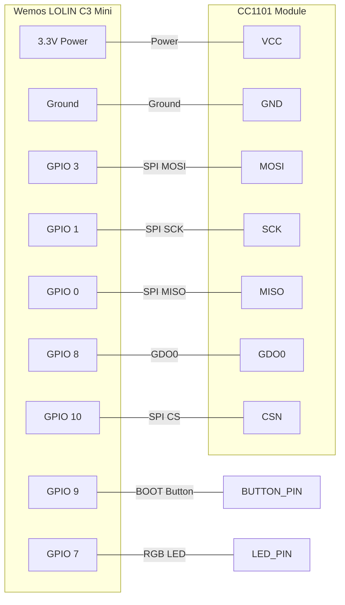

# Dogtrace d-control 400 remote clone (ESP32-C3 + CC1101)

This project replicates the control signal for a Dogtrace d-control 400 electric dog collar using a Wemos LOLIN C3 Mini (ESP32-C3) and a CC1101 transceiver module. The main goal of this project is to create a remote that can be triggered remotely (e.g., via Home Assistant). Integration with Home Assistant is possible through the included ESPHome configuration, allowing for remote triggering of the collar's sound beep function. The project is structured around a single button press (the BOOT button) that triggers the transmission of a raw RF signal captured from the original remote.

⚠️ IMPORTANT PROJECT SCOPE & DISCLAIMERS:
* Undocumented Protocol: Dogtrace publishes nothing about the link. The frame has since been reverse engineered from SDR captures far enough to describe its structure — see [What the frame looks like](#-what-the-frame-looks-like) — but **the firmware does not use that**. It still replays a stored payload verbatim, and this is not a universal "clone" of the remote.
* Raw Replay: The signal transmitted by this code is a raw, fixed-code payload meant to be captured using an SDR, cleaned up, fine-tuned, and repeated. The RF parameters used here are fine-tuned to work, but may not be the exact parameters used by the original remote. The signal is transmitted by bit-banging asynchronous timings. It is **not** PWM, despite what earlier revisions of this file said — the encoding is run-length, with all the information in the durations and none in the levels. PWM would require exactly half the runs to be long; the real frames have 21 long runs out of 88.
* Device Specific & Template Only: The original signal used to develop this project was specific to my personal remote. It is not a universal signal for all Dogtrace d-control 400 remotes, as each remote likely has a unique identifier embedded in the signal to prevent cross-interference. Instead, this code provides a structural template. To replicate a new remote, its signal has to be captured using an SDR, the timings have to be extracted and cleaned up, and then injected into the code as described in the "Adding Custom Signal" section below.
* Beep Only: This repository is structured around the sound beep function, and that is now a deliberate policy rather than a gap. The shock frames have been captured and analysed; the repository deliberately does not carry what would be needed to construct one.

---

## 📺 Demo

Demonstration of the project triggering the collar's sound beep function.


<div align="center">
  <video src="https://github.com/user-attachments/assets/95b2df5f-6e3d-44ce-ad21-af88bca1a0c2" controls="controls" style="max-width: 100%;">
  </video>
</div>


> **Note:** The video contains sound

---

## 📁 Repository Structure

```
.
├── src/          # Firmware source (main.cpp — button handling, LED feedback, TX sequence)
├── include/      # Headers: pinout.h (pin map) and signal.h (RF params + captured payload, encrypted)
├── esphome/      # ESPHome configuration for Home Assistant integration
├── pcb/          # Fabrication-ready PCB Gerber files (gerber.zip)
├── enclosure/    # 3D printable enclosure models (CAD sources + STL/3MF)
├── doc/          # Media assets (demo video)
├── platformio.ini # PlatformIO project/build configuration
└── README.md
```

---

## Hardware Requirements
* Microcontroller: Wemos LOLIN C3 Mini (ESP32-C3).
* Radio: CC1101 Transceiver Module (Must be the 868 MHz version, 26 MHz crystal).
* Antenna: 868 MHz tuned antenna (~8.2 cm quarter-wave).

---

## 🔌 Wiring Diagram

The project uses a custom SPI bus routed to specific pins on the ESP32-C3. The physical BOOT button on GPIO 9 is used to trigger the transmission.


```mermaid
graph LR
    subgraph Wemos LOLIN C3 Mini
        3V3[3.3V Power]
        GND[Ground]
        G3[GPIO 3]
        G1[GPIO 1]
        G0[GPIO 0]
        G8[GPIO 8]
        G10[GPIO 10]
        G9[GPIO 9]
        G7[GPIO 7]
    end

    subgraph CC1101 Module
        VCC_C[VCC]
        GND_C[GND]
        MOSI[MOSI]
        SCK[SCK]
        MISO[MISO]
        GDO0[GDO0]
        CSN[CSN]
    end

    3V3 ---|Power| VCC_C
    GND ---|Ground| GND_C
    G3 ---|SPI MOSI| MOSI
    G1 ---|SPI SCK| SCK
    G0 ---|SPI MISO| MISO
    G8 ---|GDO0| GDO0
    G10 ---|SPI CS| CSN
    G9 ---|BOOT Button| BUTTON_PIN
    G7 ---|RGB LED| LED_PIN
```
---

## 🧩 PCB

For a cleaner build than hand-wiring, a fabrication-ready PCB is included at `pcb/gerber.zip`. It routes the SPI bus and control pins between the Wemos LOLIN C3 Mini and the CC1101 module exactly as shown in the wiring diagram above.

* Upload `pcb/gerber.zip` directly to any PCB fab house (JLCPCB, PCBWay, OSH Park, etc.) to have the boards manufactured.
* Hand-wiring per the diagram above remains a fully valid alternative — the PCB is optional.

### Layout & Components
* **Module placement:** The Lolin C3 Mini and the CC1101 RF module are placed strategically so the RF module's antenna overhangs completely past the edge of the board, giving it clear space to radiate without the board substrate detuning or absorbing the signal.
* **ESP antenna optimization:** A deliberate copper-pour keepout was created under the ESP32's onboard antenna on **both** layers, eliminating interference and letting it transmit through clean laminate.
* **Mounting holes:** The corners carry mounting holes with a precise **2.032 mm** diameter; the copper pour flows around them with a safety clearance to prevent shorts from mounting hardware.
* **Verified footprint:** The radio's pin pitch was designed and verified at 2.00 mm (matching the `header-pin-1x8-2.00` standard).

### Routing & Electrical Integrity (DRC)
* **Differentiated track widths:** The power trace (from the 3.3V pin) is deliberately sized to **0.5 mm** for better current capacity and stability, noticeably wider than the data/signal traces, which are a precise **0.254 mm**.
* **GND net integrity:** Ground pins connect to a full-coverage copper polygon pour via thermal reliefs — ensuring a solid ground connection while still making the pads easy to hand-solder.
* **CC1101 asynchronous mode:** For asynchronous signal transmission only the **GDO0** pin is wired and used; GDO2 is left unconnected.
* **Design Rule Check:** The manufacturing rules for minimum track width were tuned to the actual design so the board passes automated DRC cleanly.

### Manufacturing / Gerber Parameters
* **Export:** Standard Gerber files, provided as `gerber.zip`.
* **Stackup & finish:** FR-4, 2 layers, 1.6 mm thickness, 1 oz copper. Surface finish is **HASL (with lead)** for easier wetting with leaded solder during hand assembly.
* **Solder mask:** Black.
* **Fab marks:** "Remove Order Number" was selected so the fab does not print its production code on the board, preserving the minimalist look of the prototype.

---

## 📡 CC1101 RF Configuration Summary

These RF parameters were fine-tuned through SDR analysis and iterative testing to reliably trigger the collar. Only the carrier frequency is based on the datasheet; the rest were derived empirically to match the original remote's physical transmission characteristics.

| Parameter | Value | Why it matters |
| :--- | :--- | :--- |
| Carrier Frequency | 869.525 MHz | The exact frequency the Dogtrace collar is listening to. Given by datasheet and confirmed via SDR. |
| Output Power | 10 dBm | Transmit power of the CC1101 Power Amplifier. Sufficient for reliable close-range triggering. |
| Modulation | OOK (On-Off Keying) | Confirmed via SDR waterfall. The collar uses simple Amplitude Modulation (power on/off). |
| Bit Rate | 100.0 kbps | 20x oversampling of the ~5kbps signal to eliminate jitter. |
| Rx Bandwidth | 116.0 kHz | Standard hardware filter step for a 26MHz crystal to ensure stable internal clock division. |
| Sync Word | Disabled | Bit-banging raw pulses; no hardware packet handling. |
| Preamble/CRC | Disabled | Bypasses the CC1101 packet engine for "Asynchronous Mode." |
| Transmission Mode| Asynchronous | Maps the physical state of GDO0 directly to the RF Power Amplifier (HIGH = RF ON, LOW = RF OFF). |
| Symbol Period | 208.647 µs (stored as 209) | Measured from SDR capture across 13 presses, not rounded. Every run length is 1 or 2 of these. See "Empirical Timing Analysis". |

---

## 🚀 Technical Specifics

### 1. 20x Bitrate Oversampling
The actual data rate of the 200 µs pulses is roughly 5.0 kBaud. However, the CC1101's internal data rate register is deliberately cranked to 100.0 kbps.
* In Asynchronous mode, the CC1101 samples the GDO0 pin based on its internal clock. At 5 kbps, it only samples every 200 µs, causing massive timing jitter. Oversampling at 100 kbps forces the chip to sample the pin every 10 µs. This ensures the Power Amplifier gates on and off instantly, creating crisp, perfectly timed OOK square waves.

### 2. Bandwidth and Clock Stability
While this project only transmits, setting the receiver bandwidth (`RxBandwidth`) to 116.0 kHz selects a stable, pre-defined hardware filter tap provided by the CC1101's internal clock dividers (based on a 26 MHz crystal). In OOK mode, the frequency synthesizer stays locked dead-center at 869.525 MHz, but a stable internal clock tree ensures the RF bursts are clean and consistent.

### 3. FreeRTOS CPU Locking
The ESP32 is a dual-core chip running a real-time OS (FreeRTOS) that handles background tasks. Background interrupts may distort the precise microsecond pulse timings required to fool the collar.
* The Fix: `vTaskSuspendAll()` locks the CPU for the duration of each **burst**.
* Watchdog: the idle task, which normally feeds the Task Watchdog Timer, cannot run while the scheduler is suspended. On the ESPHome path this is not theoretical — a 159 ms burst followed by only a 5 ms gap reset the device with `ESP_RST_TASK_WDT`. The firmware therefore calls `App.feed_wdt()` in every inter-burst gap rather than relying on idle being scheduled: Wi-Fi and lwIP outrank idle and can consume the whole window.

### 4. Burst Structure — Contiguity Matters More Than Anything Else
This is the single most important property of the transmission, and the least obvious.

**Frames within a burst are emitted back-to-back with no silence between them.** The original remote never inserts a gap mid-transmission: a tap is 7 contiguous frames (159.3 ms) and a 4.1 s hold is 180 contiguous frames, with no OFF period longer than 2 symbol periods anywhere inside either.

This is not a detail. A firmware build that sent **one** frame followed by a 5 ms gap produced **zero** beeps, while an earlier, badly mistimed payload that happened to contain 2.5 frames per burst worked about 70% of the time. Two receiver behaviours explain it, and both demand contiguity:
* **Consecutive-frame validation** — the decoder wants the next frame to arrive immediately and match before it acts, a standard guard against noise. A gap expires that timer on every frame.
* **AGC settling** — a few milliseconds without carrier lets the receiver's automatic gain control drift toward the noise floor, corrupting the start of the next frame, which is exactly where the preamble lives.

The three knobs are therefore layered and interdependent:

| Macro | Meaning | Bounded by |
| :--- | :--- | :--- |
| `FRAMES_PER_BURST` | Contiguous frames, **no gap between them** | The collar's decoder. 7 matches a real tap and is known-good |
| `TRANSMIT_GAP_US` | Silence **between bursts only** | Audibility: 5 ms is inaudible, 30 ms audibly chops the beep |
| `TRANSMIT_REPEAT` | Number of bursts, i.e. beep duration | The watchdog budget |

Raising `FRAMES_PER_BURST` means feeding the watchdog more often, or the device resets.

### 5. Empirical Timing Analysis
The symbol period is **208.647 µs**, stored as `209`. It was measured, not guessed, from three RTL-SDR captures at 2.000 MSps covering 13 button presses.

**Measure frame-start to frame-start.** Take the rising edge that opens the first frame and the rising edge that opens the seventh: 272 910 samples spanning exactly 654 ticks, giving 417.294 samples per tick. The six intermediate estimates agree to within 0.02%.

Two things make this the right baseline, and both are about the *endpoints* rather than the span:
* Both endpoints are **rising edges at the same structural position**, so rise-time bias is identical at each end and cancels instead of accumulating. (Measuring edge-to-edge on a single pulse biases high by the rise and fall time; taking both ends at the 50% crossing is the equivalent fix at small scale.)
* There is **no ambiguity about where the message ends.** The final ON tick is cut short when the button is released, so dividing the whole message span by its tick count leaves you unable to say whether the denominator is 763 or 764 — a 0.13% uncertainty you simply don't incur.

An earlier measurement across 42 preamble ticks gave 417.75, which is 0.11% high: a 16× shorter baseline carries 16× the endpoint error. An earlier version of this project used 200 µs, which is 4.5% fast.

⚠️ URH's *Autodetect parameters* reports 400 samples/symbol here — wrong by 9% — because it fits a symbol length rather than measuring one. Hand measurement caught it.

**Independently reproduced by hand**, with no scripting: URH set to ASK, Samples/Symbol 418, Error tolerance 5, Bits/Symbol 1, yielding 764 bits — this frame seven times over with zero mismatches. Worth knowing: at Error tolerance 0 the same capture silently loses five bits and produces seven frames that disagree with each other, while still looking entirely plausible to the eye.

---

## 🔑 Adding Custom Signal (Payload Configuration)

For security and safety reasons, the actual payload timings for my personal dog collar are stored encrypted (via [SOPS](https://github.com/getsops/sops) + age). This means the `include/signal.h` file shipped in a fresh clone contains encrypted ciphertext, **not** valid C code — the project will not compile until you replace it with your own captured signal as described below.

If you hold the age private key (i.e. you are me), put it at SOPS's default key location so that `sops -d -i include/signal.h` works with no environment variable and no flag. **That path is platform-dependent**, because SOPS resolves it with Go's `os.UserConfigDir()`:

| Platform | Default key path |
| :--- | :--- |
| macOS | `~/Library/Application Support/sops/age/keys.txt` |
| Linux | `~/.config/sops/age/keys.txt` |

Using the Linux path on macOS fails with `identity did not match any of the recipients` — a misleading message, since the error is that SOPS never loaded the file at all. Its diagnostic lists only the `SOPS_AGE_*` environment variables it checked and never names the default path it looked at, so it reads like "wrong key" when it means "no key here".

Confirm the right key is installed with `age-keygen -y <path>`, which prints the *public* key and must match the recipient in `.sops.yaml`. That verifies decryption will work without touching the encrypted file and without putting the private key on screen.

A pre-commit hook enforces this. `.githooks/pre-commit` refuses any commit that stages `include/signal.h` or `signal_captures.txt` in plaintext, and warns when either is left decrypted in the working tree. It inspects the staged blob rather than the file on disk, and detects encryption by looking for sops's own markers, so it needs no age key. Enable it in a fresh clone with `git config core.hooksPath .githooks` — note that a local `core.hooksPath` replaces any global one, which is why `.githooks/prepare-commit-msg` exists to chain through to it, complete with a re-entry guard that stops the two-hop loop you get when a global hook chains back into the repo's local one.

Re-encrypt with `sops -e -i include/signal.h` before committing; a decrypted `signal.h` must never be committed. If the plaintext was only read and not modified, restoring a pre-decrypt copy is preferable — `sops -e -i` generates a fresh data key and MAC, so it produces a diff even when the content is identical.

To use this project, the RF signal for the specific remote to be cloned has to be captured using an SDR (Software Defined Radio) set to AM/ASK mode. The captured microsecond timings then have to be injected into the code.

The payload is stored as **run lengths in symbol periods**, not absolute microseconds. Every element is a whole number of `BASE_TICK_US` ticks, so the entire frame is parameterised by a single number — which is what makes the calibration sweep below possible.

1. Locate the file `include/signal.h` in the repository.
2. Copy-paste the macro below into the file, overwriting its current contents.
3. Replace the dummy run lengths with your captured signal (positive numbers for HIGH/RF ON, negative for LOW/Silence), expressed as multiples of the symbol period.

```cpp
#pragma once

#define CARRIER_FREQUENCY 869.525 // Carrier frequency in MHz
#define OUTPUT_POWER 10           // CC1101 transmit power in dBm
#define BIT_RATE 100.0            // Async oversampling rate in kbps
#define RX_BANDWIDTH 116.0        // Receiver filter bandwidth in kHz
#define FRAMES_PER_BURST 7        // Contiguous frames per burst, with NO gap between them
#define TRANSMIT_REPEAT 18        // Bursts per trigger (also sets beep duration)
#define TRANSMIT_GAP_US 5000      // PA-off gap between BURSTS only, never between frames

#define BASE_TICK_US 209          // Symbol period; every run length is a multiple of this

// Replace the numbers below with your captured run lengths, in BASE_TICK_US units.
// Absolute duration of element i is BASE_TICK_US * abs(SIGNAL_BEEP_TICKS[i]).
#define SIGNAL_BEEP_TICKS { \
  1, -1, 2, -2, 1, -1, ... \
}
```

> **Note:** Keep all of the macros above — both firmware paths require them and the code will not compile without them. See "Burst Structure" under Technical Specifics for what `FRAMES_PER_BURST`, `TRANSMIT_REPEAT` and `TRANSMIT_GAP_US` do, and why the difference between "between frames" and "between bursts" is the difference between working and not working at all.

### Calibrating the symbol period

`BASE_TICK_US` matters, and a capture rounded to a convenient value will be wrong. The error is not benign: it accumulates across the frame, so a small per-tick offset becomes a large phase error by the end. A 109-tick frame sent at 200 µs when the true period is 209 µs drifts by ~1 ms — around five symbols — and a receiver with bit-sync loses lock partway through.

Measure it rather than guessing, and prefer a direct measurement to a sweep: take the rise-to-rise distance across *N* preamble periods and divide by *N*, which averages out edge noise. Then use the serial `k` command to confirm the measured value beats its neighbours, rather than to discover it.

Be aware, though, that a wrong tick produces *intermittent* triggering, whereas a wrong **burst structure** produces *no* triggering at all. If the collar never responds, check `FRAMES_PER_BURST` and the placement of `TRANSMIT_GAP_US` before you touch the timebase — that failure mode is not a calibration problem and no amount of sweeping will find it.

---

## 🛠️ Software Setup

This project is built using PlatformIO. The RadioLib library is used for CC1101 control, and Adafruit NeoPixel is used for the onboard RGB LED status indicator.

1. Ensure the signal header file is updated with the captured signal timings as described in the previous section.
2. Change the `upload_port` and `monitor_port` in the `platformio.ini` file to match the tty port assigned to the Wemos LOLIN C3 Mini when connected via USB.
3. Connect the Wemos LOLIN C3 Mini via USB.
4. Build and upload the code using `pio run --target upload` (`pio run --target upload --target monitor` if serial monitor is also desired).

---

## 🚥 Status Indication
The onboard RGB LED reports the device state:

* 🟢 **Green (0.5 s), once at boot:** CC1101 radio initialized successfully.
* 🟢 **Green pulse (80 ms) every 5 s:** Liveness heartbeat — the device is powered, running and the radio is OK.
* 🟠 **Amber pulse (80 ms) every 5 s** *(ESPHome path only)*: alive and radio OK, but **Wi-Fi is down** — the device cannot be reached from Home Assistant or `esphome logs`.
* 🔴 **Solid Red, never pulsing:** Radio initialization failed (check your SPI wiring).
* 🔵 **Solid Blue:** Actively transmitting the RF signal (CPU locked). The heartbeat is suppressed for the duration.
* ⚫ **LED Off:** No power, or the device has crashed.

The heartbeat exists so that idle is distinguishable from dead. It is also why
the colour encodes the Wi-Fi state: a device with a dropped Wi-Fi link is alive
and transmits fine, but is invisible to every other diagnostic channel, so the
LED is the only place that failure can be observed. Because the heartbeat is
gated on the radio being ready, a board that sits solid red and never pulses has
exactly one problem.

---

## 🎮 Usage
1. Power up the board and ensure the LED flashes Green, indicating successful CC1101 initialization
2. Confirm the green heartbeat pulse appears every 5 seconds — that is the device reporting it is alive and idle.
3. Press the BOOT button to transmit the signal. The LED will turn Blue during transmission, then return to the idle heartbeat once complete.

---

## 🎛️ Serial Calibration Mode

Tuning the signal by editing `signal.h` and reflashing costs a couple of minutes per trial, which makes a proper parameter sweep impractical. The firmware therefore exposes the RF parameters over the serial monitor (115200 baud) so they can be changed at runtime. Nothing is persisted — a reset restores the values compiled in from `signal.h`.

| Command | Effect |
| :--- | :--- |
| `k <us>` | Symbol period (`BASE_TICK_US`) — the primary calibration parameter |
| `p <dBm>` | Output power |
| `r <n>` | Repeat count |
| `g <us>` | Inter-frame gap |
| `f <MHz>` | Carrier frequency |
| `m <0\|1>` | Timing engine: `0` legacy, `1` absolute-deadline scheduling + synthesiser settle |
| `t` | Transmit one burst |
| `?` | Print current state |

**Finding the symbol period.** Fix the collar at a marked distance, then sweep `k` across a range around the nominal value, firing ~20 bursts with `t` at each step and recording how many trigger the beep. Plot success rate against `k`. A distinct peak away from the nominal value means the captured timings were rounded, and the peak is your real symbol period. A flat, uniformly mediocre curve means the problem is the frame *structure* rather than its timebase, and a fresh SDR capture is needed.

**Timing engine A/B.** `m 0` reproduces the original bit-banging loop exactly, including its per-edge behaviour; `m 1` schedules every edge against a fixed timebase so that per-edge overhead stops accumulating across the frame, and adds a short synthesiser settle before the first pulse. Comparing success rates between the two modes at the same `k` measures how much the timing engine was actually costing.

> **Safety:** the transmit burst runs with the FreeRTOS scheduler suspended, so it must complete well inside the task watchdog window. Any `k`, `r`, or `g` change that would push the burst past ~4 seconds is rejected with an error rather than accepted, and the previous value is kept.

---

## 🖨️ 3D Printed Enclosure

The `enclosure/` directory contains parametric CAD models and ready-to-print files for a protective case that houses the device. The design is optimized for FDM 3D printing without supports and uses a friction-fit joint to secure the lid.

| Closed | Open |
| :---: | :---: |
|  |  |

**Directory contents:**

| File | Format | Purpose |
| :--- | :--- | :--- |
| `enclosure/d-control-400-remote-enclosure.f3d` | F3D | Source parametric archive from Fusion 360 (includes full timeline and sketches). |
| `enclosure/d-control-400-remote-enclosure.step` | STEP | Universal CAD model (useful for collision checks directly in PCB/EDA software). |
| `enclosure/d-control-400-enclosure.3mf` | 3MF | PrusaSlicer project with preset orientation and print profiles. |
| `enclosure/d-control-400-case.stl` | STL | Exported mesh of the case body for direct printing. |
| `enclosure/d-control-400-lid.stl` | STL | Exported mesh of the lid for direct printing. |

**Recommended print settings (Prusa MK4):**
* **Material:** PLA
* **Profile:** `0.20mm STRUCTURAL (Input Shaper)` — *Critical for holding the tight dimensional tolerance of the friction-fit joint (-0.1 mm).*
* **Nozzle:** 0.4 mm
* **Supports:** None — *The USB-C connector cutout (13×7 mm) is designed so the printer can bridge it cleanly without supports.*
* **Part orientation:**
  * **Case:** Flat bottom directly on the build plate.
  * **Lid:** Outer face (with the centered recessed text) directly on the build plate for a smooth finish.

**Assembly and disassembly:**
The lid slides into the case until fully seated and is held in place by the interference fit. For safe and easy opening, a hidden pry slot (screwdriver slot) with an internal fillet is located on the top edge of the case's rear wall. To pop the lid off, simply insert a standard 5 mm flat-head screwdriver into the slot and lever it open.

---

## ESPHome Integration

Integration to Home Assistant is possible with the ESPHome configuration included in the `esphome/` directory. This allows the device to be triggered remotely, while keeping the option to use the physical BOOT button as a manual trigger. While automations are possible, it is discouraged to trigger the collar remotely without a physical confirmation step, as this could lead to accidental activations.

> **Note:** If required, the LED status indication can be also exposed to Home Assistant by removing the `internal: true` flag from the `status_led` component in the ESPHome configuration. This allows for remote monitoring of the device's state.

---

## 📻 What the frame looks like

Decoded in September 2026 from a differential capture campaign — beep and shock,
channels A and B, all 20 shock levels, 42 distinct frames extracted from raw IQ
and cross-checked against hand measurements in Universal Radio Hacker.

Every frame this handset sends is **88 runs** of one or two symbol periods
(T = 208.647 µs), and the encoding is **run-length**: the levels carry no
information at all, because two adjacent runs at the same level would merge into
one. Everything is in the durations. That rules out NRZ, Manchester, PWM and PPM
outright, and `ticks = 88 + (number of long runs)` holds as an identity on every
frame measured.

Of the 88 runs, **68 are identical across everything the handset transmits** —
both functions, both channels, all 20 intensity levels. The remaining 20 carry the
whole command surface. Writing `A` for a short run and `B` for a long one:

```
run     field
0-30    preamble          31 short runs
31-44   constant          handset-specific
45-46   channel           AB = channel A,  BA = channel B
47-66   constant          handset-specific
67-68   function          AB = beep,       BA = shock
69-70   constant          handset-specific
71-78   level             8 runs, MSB first, long = 1
79-86   redundancy        run 79+i against run 71+i:
                            i = 0..3   always complement
                            i = 4,5    complement = shock, copy = beep
                            i = 6,7    (complement, copy) = channel A
                                       (copy, complement) = channel B
87      constant          always short
```

The 68 constant runs are what stays encrypted, along with the level-to-value table.
The schema above is a property of the protocol and is discoverable by anyone with
this model and an SDR; the constants are one specific handset's identity, and they
are the only thing that makes a frame *this* remote's.

The redundancy block is the nice part, and it is not a checksum. It is the level
field re-emitted through a mask: four of its eight positions always invert the
original, and the other four invert or copy depending on which channel and which
function is being sent. Each command is therefore stated twice — once outright in
its own field, and once as a perturbation of the redundancy. A receiver that
validates the two halves against each other reads the command out of the comparison
itself, which buys error detection and addressing from the same bits.

Neither the channel nor the function field ever uses `AA` or `BB` — only the two
transposed values. That admits two readings the captures cannot separate, because
there are only two observations of each field: either they are two-bit fields with
two states spare, leaving room for two more functions and two more channels, or
they are one-bit fields in a balanced 1-of-2 code where `AA` and `BB` are invalid
codewords and there is no headroom at all. The d-control range includes models with
more channels, so a higher model in the family would settle it.

The level-to-value map is a monotone but strongly non-linear lookup table across
the 20 dial positions, with no formula recovered. It lives in the *remote* — the
handset decides what value to send — so the collar holds a second, different map
from value to electrical output. If that value is a physical quantity such as a
pulse width, a formula may exist behind the table; establishing that means
instrumenting the collar's output, not capturing more RF.

Three questions the captures cannot settle, in descending order of what they would
buy:

* **Are those 68 constant runs really a per-handset identifier?** They are constant
  under every axis a single handset can vary, which is a much weaker claim, and it is
  the assumption the "Device Specific" disclaimer above has always rested on.
  **Settling it requires a second remote** — nothing that can be captured from this
  one will do it. Diffing two handsets splits the constant block into what differs
  (identity) and what agrees (protocol framing), with one caveat worth designing for
  in advance: two remotes may also differ by firmware or protocol revision, since each
  remote and collar ships as a pair. A revision field would show up in that same diff.
  A third handset disambiguates, and so does the structural tell — an identifier is
  likely one contiguous field, a revision counter likely sits apart and takes small
  values.
* **Is there a formula behind the level-to-value map?** The 20 values are monotone
  and strongly non-linear, and nothing has been recovered from the numbers alone. The
  map lives in the *remote*, so the collar holds a second and separate map from value
  to electrical output. If the transmitted value is a physical quantity — a pulse
  width being the plausible one for a switched source — then the table is samples of a
  curve rather than an arbitrary lookup. Testing that means instrumenting the collar's
  output against the value, so it needs an oscilloscope and the hardware already on the
  bench rather than a second remote, which makes it the cheapest of the three.
  ⚠️ Same condition as the capture work: the collar must not be worn by an animal.
* **Is the two-collar limit enforced by the protocol?** *(Highly optional.)* Nothing
  in the frame enforces it; the channel is simply two more address runs, so pairing
  two collars to the same channel should make both fire. This tests the system rather
  than the protocol and nothing else depends on the answer — it is recorded because it
  is a clean prediction, not because it justifies buying a collar.

---

## Possible future improvements

### 1. Move transmission from the CPU to the RMT peripheral

Today the waveform is bit-banged from the CPU with the FreeRTOS scheduler suspended, and every awkward constraint in this project descends from that one fact: frames must be contiguous, the CPU must be released periodically or the watchdog fires, and the release must be brief or the beep audibly chops. Three requirements, one knob.

The ESP32-C3's **RMT** peripheral — Remote Control Transceiver, built for exactly this class of signal, and already used here to drive the WS2812 status LED — clocks a pulse train out of a buffer in hardware with no CPU involvement. That removes all three constraints at once: no `vTaskSuspendAll()`, no inter-burst gap, no watchdog exposure, and timing that Wi-Fi activity cannot perturb. It would also permit a genuinely continuous transmission for the full beep duration, exactly like holding the remote's button, which the present design cannot do at all.

The frame fits neatly: an RMT symbol packs two level+duration entries, so 88 runs = **44 symbols** against a 48-symbol channel block. The open question is whether the C3 supports hardware TX looping, or whether continuous output needs a wrap-around refill interrupt.

### 2. ~~Capture the shock signal at several levels, and the B channel~~ — done

Closed in September 2026. The campaign covered beep and shock across both channels
and all 20 levels, and the layout is summarised in
[What the frame looks like](#-what-the-frame-looks-like). What remains are the two
hardware questions listed there, needing a second remote and a second collar.

⚠️ Understanding the shock frames means being able to transmit them. **The collar
must not be worn by an animal during this kind of work.** Beep-only remains the
scope of the shipped firmware, and the repository deliberately does not carry what
would be needed to build a shock frame.

---

## 📄 License

This project is licensed under the MIT License — see the [LICENSE](LICENSE) file for details. The software is provided "as is", without warranty of any kind; use it responsibly and at your own risk, keeping the safety disclaimers at the top of this document in mind.

